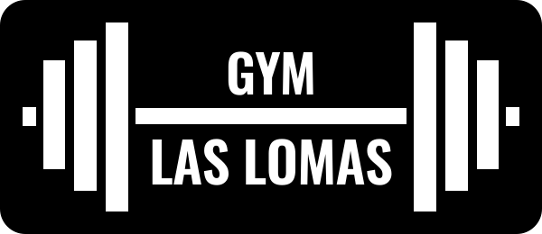
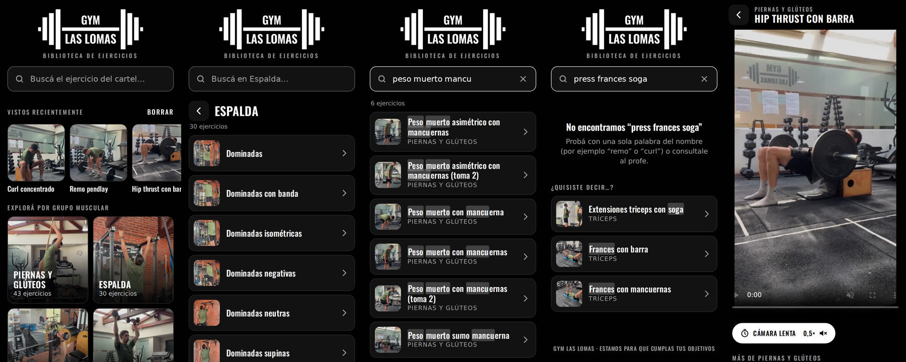
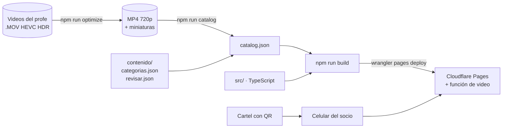

<p align="center">
  
</p>

<h3 align="center">Biblioteca de ejercicios en video</h3>

<p align="center">
  Los socios escanean un QR en la pared y ven cómo se hace cada ejercicio de su rutina.<br>
  Sin login, sin instalar nada, desde cualquier celular.
</p>

<p align="center">
  <a href="https://gymlaslomas.pages.dev"><b>gymlaslomas.pages.dev</b></a>
  ·
  <a href="docs/REGLAS-DE-NEGOCIO.md">Reglas de negocio</a>
  ·
  <a href="docs/ARQUITECTURA.md">Arquitectura</a>
  ·
  <a href="CHANGELOG.md">Changelog</a>
</p>

<p align="center">
  <a href="../../actions/workflows/ci.yml"></a>
  
  
  
</p>

<p align="center">
  
</p>

---

## El problema y la solución

En Gym Las Lomas cada rutina está en un cartel en la pared, con el nombre de los ejercicios. Cuando un socio no
recuerda cómo se hace uno, tiene que esperar a que el profe se libere.

**La solución:** el profe grabó un video de cada ejercicio, y un **QR al lado de cada cartel** abre esta web.
El socio escribe el nombre que lee en el cartel y mira el video. Del escaneo al video en menos de 15 segundos.

## Funcionalidades

| | |
|---|---|
| 🔎 **Búsqueda tolerante** | Ignora tildes y mayúsculas, acepta palabras incompletas en cualquier orden y errores de tipeo (`hip trust`, `remo pendlai`). Resalta lo que coincide. |
| 💡 **"¿Quisiste decir…?"** | Si no hay resultados, sugiere los más parecidos, dando más peso a las palabras raras. Nunca una pantalla vacía. |
| 🗂️ **Grupos musculares** | Inicio con 8 grupos con foto, en vez de una lista de 190. Cada grupo tiene su propio buscador. |
| 🐢 **Cámara lenta** | Reproduce a 0,5× y silencia la música, para ver bien la técnica. |
| 🕘 **Vistos recientemente** | Guardado solo en el celular de cada socio, con opción de borrar y deshacer. |
| ↩️ **Navegación natural** | El botón atrás del celular funciona y vuelve a la misma altura de la lista. Cada ejercicio tiene su link para compartir. |
| ♿ **Accesible** | Zonas táctiles de 44 px, contraste WCAG AA, avisos para lectores de pantalla, `prefers-reduced-motion`. |
| ⚡ **Liviana** | Unos 35 KB de carga inicial con la fuente incluida. Videos en 720p de 1 a 5 MB. Funciona con mala señal. |
| 🔒 **Privada** | Sin cuentas, sin cookies de seguimiento, sin datos personales. Las estadísticas son anónimas. |

## Cómo funciona



- **Sitio 100 % estático, sin backend ni base de datos.** La carpeta de videos es la fuente de verdad: lo que
  está en la carpeta es lo que se publica.
- **TypeScript sin frameworks** (D-02): la interfaz es un buscador, una lista y un reproductor; un framework sumaría peso sin aportar.
- **Búsqueda propia** (D-03): unas 170 líneas, con reglas de negocio explícitas y tests.
- **Una función de Cloudflare** sirve los videos por partes (`Range`/206), sin lo cual no se reproducen en iPhone (D-10).

El detalle de cada decisión está en [`docs/ARQUITECTURA.md`](docs/ARQUITECTURA.md).

## Empezar

**Requisitos:** Node.js 22 (`.nvmrc`). ffmpeg no hace falta: viene incluido como dependencia (`ffmpeg-static`).

```bash
npm install
cp .env.example .env          # configurá VIDEOS_DIR (y RAW_VIDEOS_DIR si vas a comprimir videos)
npm run dev                   # http://localhost:5173
```

En WSL, una carpeta de Windows como `D:\videos` se escribe `/mnt/d/videos`.

### Comandos

| Comando | Qué hace |
|---|---|
| `npm run dev` | Genera el catálogo y levanta el servidor de desarrollo (sirve los videos desde `VIDEOS_DIR`) |
| `npm run check` | Typecheck + tests. Se corre en CI en cada push |
| `npm test` | Tests (`node:test`, sin dependencias extra) |
| `npm run optimize -- <origen> <destino>` | Convierte los videos a MP4 720p (HDR → SDR) y genera miniaturas. Nunca toca los originales |
| `npm run catalog` | Regenera `public/catalog.json` y muestra advertencias de contenido |
| `npm run build` | Catálogo en modo estricto (falla con advertencias) + typecheck + build en `dist/` |
| `npm run qr -- <url>` | Genera el QR y el cartel A4 para imprimir en `qr/` |

## Contenido: agregar o cambiar ejercicios

1. Guardar el video original en la carpeta de originales (`RAW_VIDEOS_DIR`). **El nombre del archivo es el nombre
   que ve el socio** y tiene que coincidir con el cartel (RN-05).
2. `npm run optimize`: convierte solo lo nuevo.
3. Agregar el ejercicio a su grupo en [`contenido/categorias.json`](contenido/categorias.json) (RN-07).
4. `npm run catalog`: resolver toda advertencia (nombres repetidos, copias, formato, peso).
5. Publicar.

Si un video todavía no se puede resolver (por ejemplo, dos tomas del mismo ejercicio), se carga en
[`contenido/revisar.json`](contenido/revisar.json): se publica con un nombre prolijo y queda en la lista de pendientes.

Con Claude Code, todo esto es `/agregar-ejercicios`.

## Publicar

Producción en **Cloudflare Pages**, proyecto `gymlaslomas`.

```bash
npm run build
set -a && . ./.env && set +a       # carga las credenciales de Cloudflare desde .env
npx wrangler pages deploy dist --project-name gymlaslomas --branch main
```

- Solo se suben los archivos que cambiaron: sumar videos tarda segundos.
- Para volver a una versión anterior: panel de Cloudflare → Workers & Pages → `gymlaslomas` → Deployments → *Rollback*.
- Con Claude Code: `/publicar`. Pide confirmación antes de subir y verifica después.

La dirección `gymlaslomas.pages.dev` está impresa en los QR: **no se cambia** (RN-14). Un dominio propio se puede
sumar desde el panel sin romper la dirección actual.

## Estructura

```
├── src/
│   ├── main.ts              UI: inicio, listas, reproductor, historial
│   ├── search.ts            búsqueda tolerante, sugerencias, resaltado (puro)
│   ├── router.ts            rutas por hash (puro)
│   ├── range.ts             pedidos parciales de video (puro)
│   ├── styles.css           estilos mobile first, marca
│   └── assets/logo.svg      logo vectorial
├── functions/videos/        función de Cloudflare Pages: video por partes para iPhone
├── scripts/
│   ├── catalog-lib.mjs      reglas del catálogo (puro)
│   ├── catalog.mjs          carpeta de videos → public/catalog.json
│   ├── optimize.mjs         compresión de videos y miniaturas
│   └── qr.mjs               QR y cartel A4
├── contenido/               categorías y pendientes de revisión (editable por el gimnasio)
├── tests/                   tests de búsqueda, catálogo, rutas y rangos
├── docs/                    reglas de negocio, flujos, arquitectura, marca, roadmap
├── public/                  estáticos: ícono, manifest, 404, reglas de caché
└── .claude/                 configuración de Claude Code
```

## Calidad

- **Tests:** la lógica de negocio está separada del DOM y del disco, y tiene tests (`npm test`).
  Cada regla relevante tiene el suyo: búsqueda (RN-11 a RN-13), catálogo (RN-05 a RN-10), rutas (RN-15, RN-16, RN-19) y pedidos parciales (D-10).
- **CI:** GitHub Actions corre typecheck y tests en cada push y pull request.
- **Reglas de negocio citables:** cada comportamiento se apoya en una regla `RN-XX` o una decisión `D-XX`, que se citan en el código y los commits.

## Trabajar con Claude Code

El repo incluye configuración para [Claude Code](https://claude.com/claude-code). [`CLAUDE.md`](CLAUDE.md) define las reglas del proyecto.

| | Nombre | Para qué |
|---|---|---|
| Skill | `/agregar-ejercicios` | Revisa nombres, comprime, asigna categoría y valida videos nuevos |
| Skill | `/publicar` | Controles, deploy y verificación. Solo se ejecuta a pedido |
| Skill | `/generar-cartel` | QR y cartel A4, con checklist de impresión |
| Skill | `/nueva-funcionalidad` | Diseña una feature respetando reglas, arquitectura y roadmap |
| Agente | `revisor-reglas` | Revisa cambios contra las reglas de negocio |
| Agente | `revisor-ux-movil` | Revisa UI y textos para el celular dentro del gym |
| Agente | `curador-videos` | Audita nombres, duplicados, formatos y pesos del contenido |
| Hook | `check.mjs` | Corre typecheck y tests después de cada edición de código |

## Seguridad y privacidad

- **Credenciales:** el token de Cloudflare vive solo en `.env` (excluido de git). Nunca se commitea, se imprime ni se comparte. Ver [`.env.example`](.env.example).
- **Socios:** no hay cuentas, formularios ni cookies. "Vistos recientemente" queda solo en el navegador de cada uno (RN-02, RN-03).
- **Estadísticas:** Cloudflare Web Analytics, anónimo y sin cookies (D-12).
- **Contenido:** los videos no se versionan en git: se publican en Cloudflare desde la carpeta local.

## Documentación

| Documento | Contenido |
|---|---|
| [Reglas de negocio](docs/REGLAS-DE-NEGOCIO.md) | Lo que el producto tiene que cumplir: actores y reglas `RN-01`… |
| [Flujos](docs/FLUJOS.md) | Socio, carga de videos, publicación e instalación en el gym |
| [Arquitectura](docs/ARQUITECTURA.md) | Piezas, contrato de `catalog.json`, rutas y decisiones `D-01`… |
| [Marca](docs/MARCA.md) | Logo, colores y tipografía de Gym Las Lomas |
| [Roadmap](docs/ROADMAP.md) | Próximas versiones: estadísticas de uso, rutinas por QR, panel para profes |
| [Changelog](CHANGELOG.md) | Historial de versiones |

## Licencia

Software privado desarrollado para **Gym Las Lomas**. Todos los derechos reservados: ver [LICENSE](LICENSE).
Los videos, el logo y la marca pertenecen a Gym Las Lomas y no forman parte de este repositorio.
