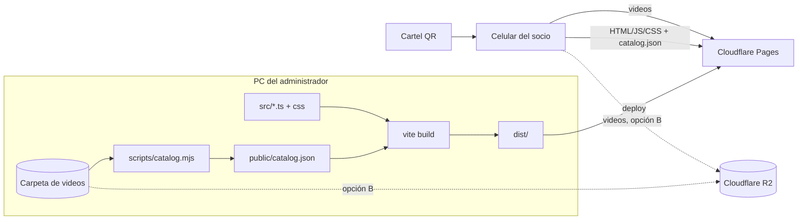

# Arquitectura

## Vista general



- **Sitio 100 % estático.** No hay servidor, base de datos ni API. Todo se resuelve en el navegador.
- **El catálogo se genera en el build** a partir de la carpeta (RN-04, RN-21).
- **Los videos se sirven como archivos estáticos**, desde Pages (opción A) o desde R2 (opción B), según `VIDEO_BASE_URL`.

## Piezas

| Archivo | Responsabilidad |
|---|---|
| `scripts/catalog.mjs` | Recorre `VIDEOS_DIR`, lee `contenido/categorias.json`, aplica las reglas de `catalog-lib.mjs` y escribe `public/catalog.json` |
| `scripts/catalog-lib.mjs` | Reglas puras del catálogo: nombres (RN-05), duplicados (RN-06), categorías (RN-07), formato (RN-10) |
| `contenido/revisar.json` | Videos publicados pero pendientes de revisión, con su motivo y su nombre visible (RN-06) |
| `contenido/categorias.json` | Categoría de cada ejercicio cuando los videos no están en subcarpetas (RN-07). Editable por el profe |
| `scripts/optimize.mjs` | Convierte originales al formato de RN-10 y genera miniaturas. Respeta RN-09 |
| `scripts/qr.mjs` | Genera el QR (corrección de errores H) y el cartel A4 |
| `scripts/env.mjs` | Carga `.env` y define las extensiones aceptadas |
| `src/search.ts` | Motor de búsqueda (RN-11, RN-12). Puro, sin DOM, cubierto por tests |
| `src/router.ts` | Rutas por hash: inicio, categoría, todos, ejercicio (RN-15, RN-16, RN-19). Puro, con tests |
| `src/main.ts` | UI: inicio con grupos musculares, listas, recientes, reproductor, historial (RN-19) |
| `src/styles.css` | Estilos mobile first, tema oscuro |
| `vite.config.ts` | En desarrollo sirve la carpeta de videos con soporte de Range; en el build la copia si `COPY_VIDEOS=1` |
| `public/_headers` | Caché en Cloudflare: `catalog.json` sin caché, assets inmutables, videos 7 días |

## Contrato de `catalog.json`

```ts
interface Catalog {
  generatedAt: string;          // ISO 8601
  videoBaseUrl: string;         // "/videos/" o URL absoluta del bucket
  categories: string[];         // ordenadas alfabéticamente (es)
  exercises: {
    id: string;                 // slug único derivado del nombre (RN-15)
    name: string;               // nombre visible (RN-05)
    category: string | null;    // subcarpeta de primer nivel (RN-07)
    src: string;                // ruta relativa a videoBaseUrl, con "/"
    poster: string | null;      // miniatura relativa a videoBaseUrl
    size: number;               // bytes
  }[];                          // ordenados alfabéticamente (es)
}
```

Si cambia este contrato, hay que actualizar a la vez `src/types.ts`, `scripts/catalog.mjs` y este documento.

## Rutas

| URL | Qué muestra |
|---|---|
| `/#/` | Inicio: buscador, vistos recientemente, grupos musculares |
| `/#/c/espalda` | Lista de una categoría (el buscador busca dentro) |
| `/#/todos` | Lista completa |
| `/#/e/remo-pendlay` | Reproductor del ejercicio, encima de la vista anterior |
| `/?q=remo` | Abre con la búsqueda "remo" hecha |
| `/?cat=Espalda` | Abre en la categoría (equivale a `#/c/espalda`) |

Los links internos se apilan en el historial con `pushState({ inApp: true })`. Así, el "volver" de la interfaz
usa el historial cuando la pantalla anterior es de la web, y si se entró por un link directo, va a la pantalla
padre sin sacar al socio de la web.

Se usa hash (`#/e/…`) para que funcione en cualquier hosting estático sin configurar redirecciones.

## Decisiones

Registro de decisiones técnicas. Cada una dice qué se eligió, por qué y qué se descartó.

**D-01 · Sitio estático sin backend.** Costo cero, nada que mantener ni que se caiga, y no hay datos de usuarios
que proteger (RN-01, RN-02). Descartado: un backend con panel de administración, que no hace falta mientras
el administrador cargue los videos desde la PC.

**D-02 · TypeScript sin framework.** La UI es una lista, un buscador y un reproductor. Sin framework la web pesa
unos 13 KB y abre al instante en celulares de gama baja (RN-18). Descartado: React o Vue, que suman unos 40 KB
sin aportar nada a esta escala. Conviene revisarlo si aparece un panel de administración.

**D-03 · Búsqueda propia en lugar de una librería.** Son unas 100 líneas, se ajusta exactamente a RN-11
(tildes, palabras de relleno, umbrales de error) y es testeable. Descartado: Fuse.js, que da resultados
menos predecibles con nombres cortos y suma peso.

**D-04 · Catálogo generado en el build.** La carpeta es la fuente de verdad (RN-04). Un JSON estático
se cachea bien y no requiere servidor.

**D-05 · Cloudflare Pages (+ R2 opcional).** Plan gratuito generoso, CDN en Argentina, y R2 no cobra
por el tráfico, que en un sitio de videos es el costo principal. Descartado: YouTube no listado
(publicidad, videos sugeridos de otros canales y peor experiencia dentro de la web) y Vercel/Netlify
(límites de ancho de banda más bajos para video).

**D-06 · Rutas con hash.** No necesita reglas de redirección en el hosting y el botón "atrás" funciona
de forma nativa (RN-19).

**D-08 · Categorías en un archivo, no moviendo videos.** Los originales del profe están todos en una carpeta,
sin subcarpetas. Para no reorganizarlos (RN-09), las categorías se definen en `contenido/categorias.json`,
que queda versionado y es fácil de revisar. Las subcarpetas siguen funcionando y tienen prioridad.

**D-09 · Fuente incluida en la web.** Oswald se sirve desde el mismo sitio (`@fontsource/oswald`, solo latin 500 y 600,
unos 25 KB) en lugar de Google Fonts: carga más rápido y no le pasa datos de los socios a terceros (RN-02).
Ver `docs/MARCA.md`.

**D-07 · Sin service worker en la v1.** Cachear videos offline complica las actualizaciones y ocupa
espacio en el celular del socio. Queda en el roadmap.
