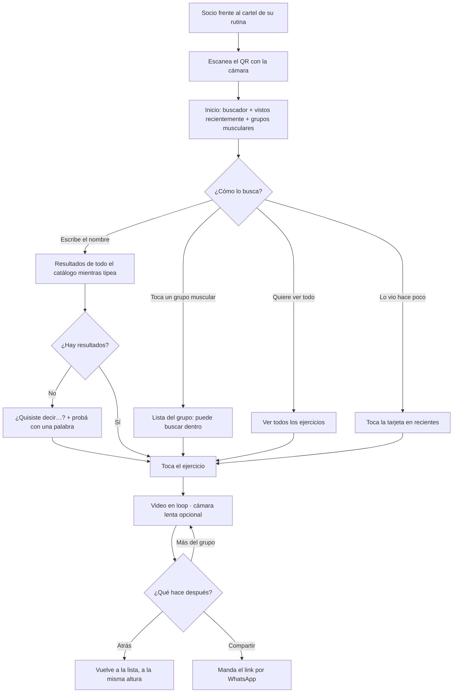
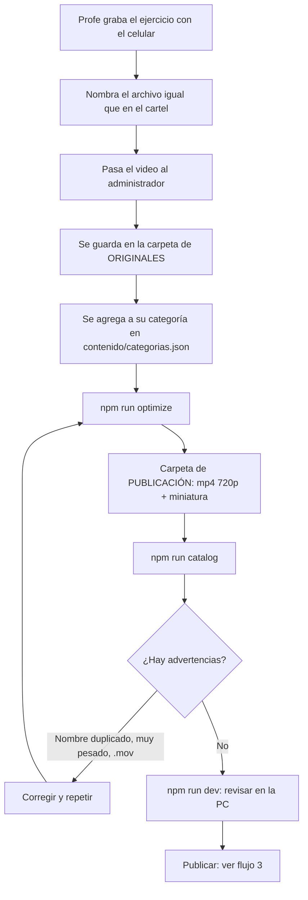
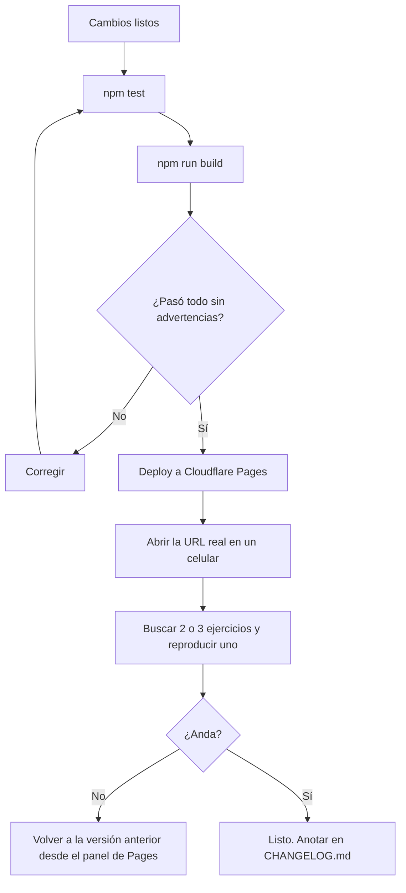

# Flujos

## 1. Socio: ver cómo se hace un ejercicio



No se muestran los 190 ejercicios de entrada: el inicio ofrece buscar o elegir un grupo muscular, como las
apps de entrenamiento de referencia. La lista completa está a un toque ("Ver todos los ejercicios").

Reglas: RN-01, RN-03, RN-11 a RN-13, RN-18, RN-19.

**Objetivo de tiempo:** del escaneo al video en menos de 15 segundos con datos móviles.

## 2. Profe y administrador: agregar o cambiar ejercicios



Reglas: RN-04 a RN-10, RN-21.

Skill de Claude Code: `/agregar-ejercicios`.

### Carpetas

```
D:\las lomas\          ← originales del profe (RAW_VIDEOS_DIR). NUNCA se modifican (RN-09)
  peso muerto rumano.MOV
D:\las lomas web\      ← lo que se publica (VIDEOS_DIR), lo genera npm run optimize
  peso muerto rumano.mp4
  peso muerto rumano.jpg
contenido/categorias.json  ← en qué categoría va cada ejercicio (RN-07)
```

## 3. Publicar una versión



Reglas: RN-21, RN-22. Skill de Claude Code: `/publicar`.

## 4. Primera instalación en el gimnasio (una sola vez)

1. Definir la URL definitiva (dominio propio o `*.pages.dev`). **No se cambia después** (RN-14).
2. Publicar la primera versión con todos los videos.
3. `npm run qr -- <URL>` e imprimir `qr/cartel.html` en A4 (con "Gráficos de fondo" activado).
4. Probar el QR impreso con al menos un iPhone y un Android, a la distancia real de uso.
5. Pegar un cartel QR al lado de cada cartel de rutinas, a la altura de los ojos y con buena luz.
6. Contarles a los profes el flujo 2 y qué nombres usar.

Skill de Claude Code: `/generar-cartel`.
